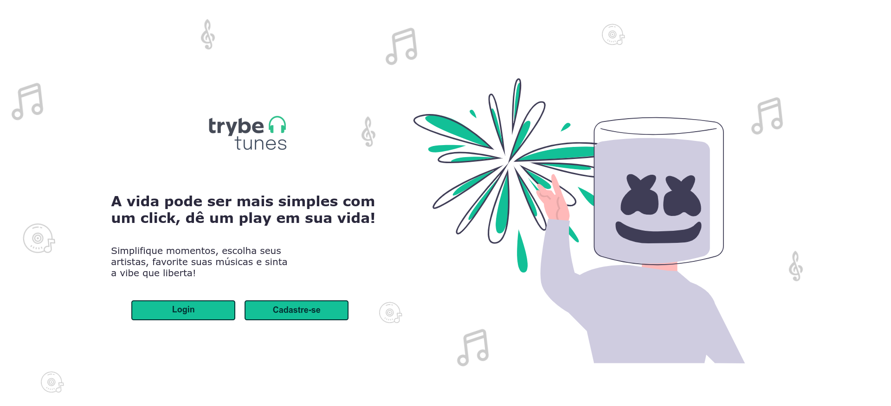
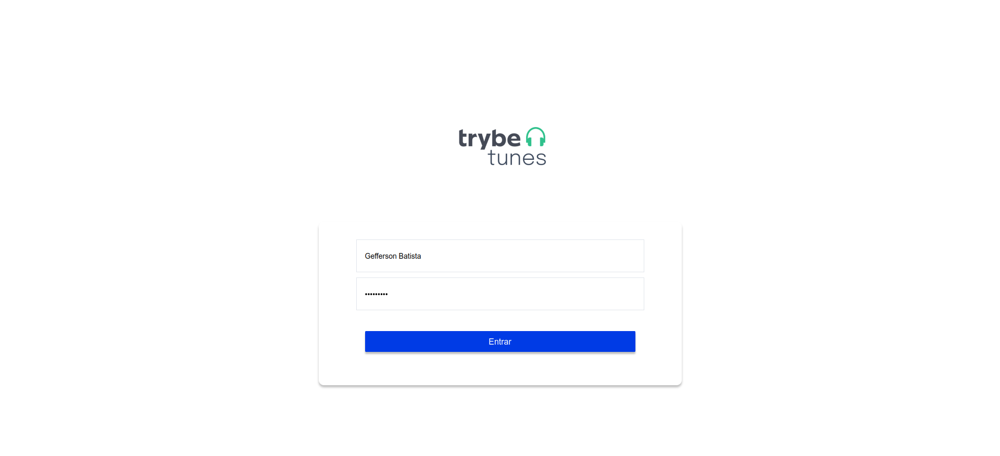
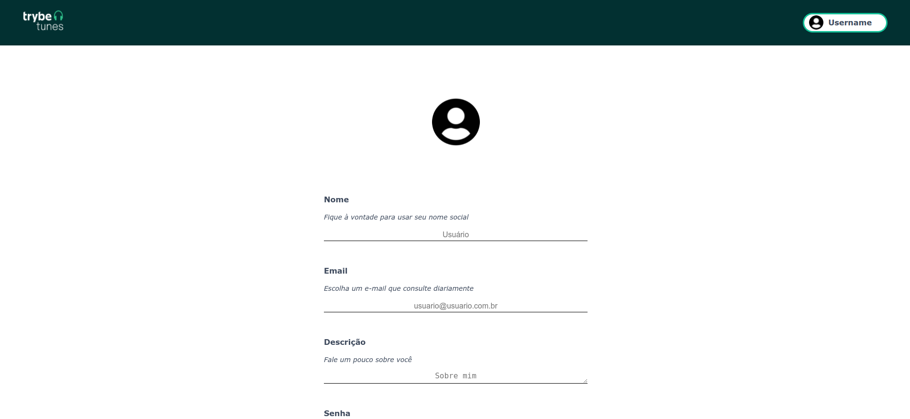
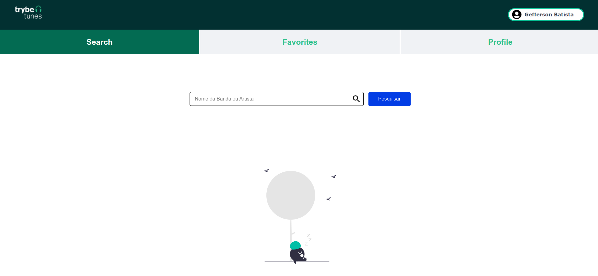
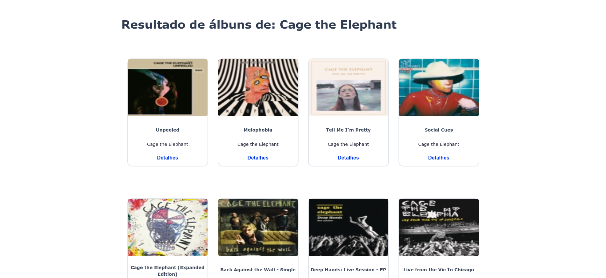
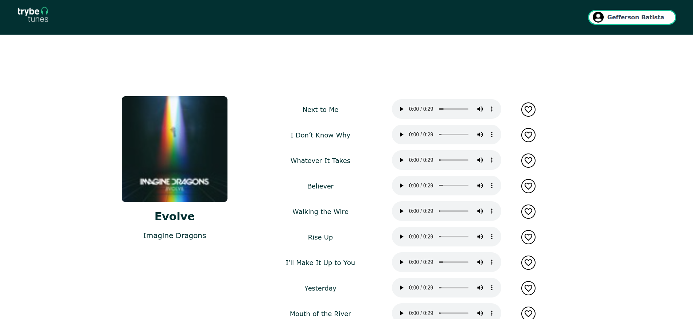
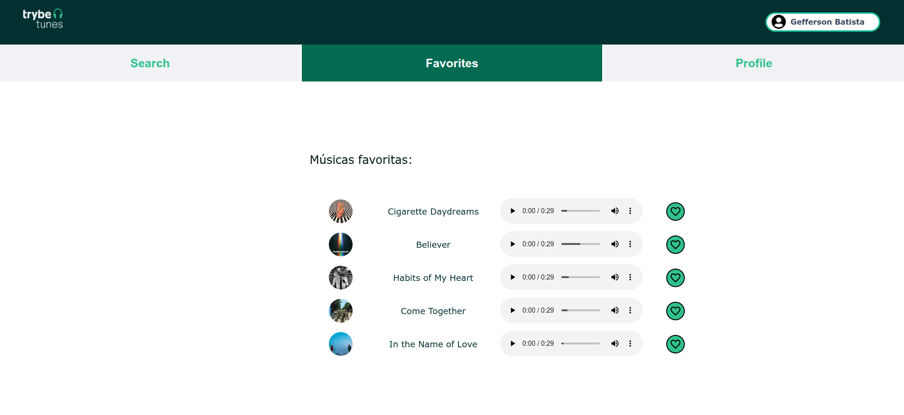
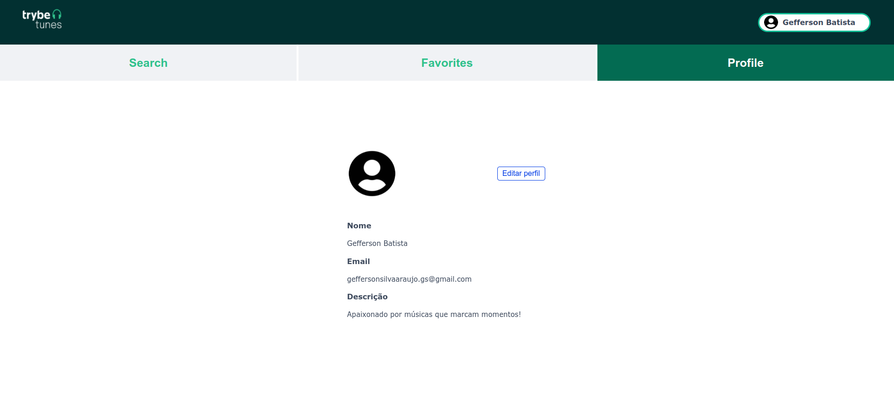
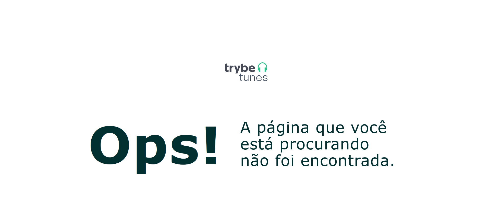

[](https://github.com/tterb/atomic-design-ui/blob/master/LICENSEs)
# TrybeTunes


O TrybeTunes, é uma aplicação capaz de reproduzir músicas das mais variadas bandas e artistas, criar uma lista de músicas favoritas e editar o perfil da pessoa usuária logada. O usuário será capaz de:

  - Fazer login;
  - Pesquisar por uma banda ou artista;
  - Listar os álbuns disponíveis dessa banda ou artista;
  - Visualizar as músicas de um álbum selecionado;
  - Reproduzir uma prévia das músicas deste álbum;
  - Favoritar e desfavoritar músicas;
  - Ver a lista de músicas favoritas;
  - Ver o perfil da pessoa logada;
  - Editar o perfil da pessoa logada;

  ---

  ### Protótipo do projeto
Você pode acessar um protótipo no link abaixo:

https://www.figma.com/file/BDQgAJvOe4KNUjmrYh5t68/TrybeTunes-Figma

  ---
## Para instalar localmente

1. Clone o repositório
  * `git clone git@github.com:imgeff/trybetunes.git`.
  * Entre na pasta do repositório que você acabou de clonar:
    * `cd trybetunes`

2. Instale as dependências e inicialize o projeto
  * Instale as dependências:
    * `npm install`
  * Inicialize o projeto:
    * `npm start`

  ---

## ESLint e Stylelint

Para garantir a qualidade do código, foi utilizado neste projeto os linters `ESLint` e `Stylelint`.
Assim o código estará alinhado com as boas práticas de desenvolvimento, sendo mais legível e de fácil manutenção! Para rodá-los localmente no projeto, execute os comandos abaixo:

```bash
npm run lint
npm run lint:styles
```

  ---

## Código feito pela Trybe

  O diretório `src/services`, que contém os arquivos `favoriteSongsAPI.js`, `searchAlbumsAPI.js`, `userAPI.js` e `musicsAPI.js`. Esses arquivos foram feitos pela equipe de instrução da Trybe e são responsáveis por lidar com as requisições simuladas que foram usadas durante o desenvolvimento.

### `userAPI.js`

O arquivo `userAPI.js` foi utilizado para manipular as informações da pessoa logada, dentro dele estarão as funções para recuperar e atualizar as informações da pessoa usuária, além de criar um novo perfil. Todas essas funções simulam o funcionamento de uma API.

### `searchAlbumsAPI.js`

O arquivo `searchAlbumsAPI.js` contém uma função que faz uma requisição à uma API e retorna os álbuns de uma banda ou artista. Para essa função funcionar, ela recebe como parâmetro uma string, que deve ser o nome da banda ou artista. O retorno dessa função, quando encontra as informações, é um array com cada álbum dentro de um objeto.

### `favoriteSongsAPI.js`

O arquivo `favoriteSongsAPI.js` é responsável por manipular as informações das músicas favoritas. Nele há as funções `getFavoriteSongs`, `addSong` e `removeSong`, que recuperam, adicionam e removem músicas dos favoritos, respectivamente. Assim como nos arquivos anteriores, todas as funções simulam o funcionamento de uma API.

### `musicsAPI.js`

O arquivo `musicsAPI.js` contém uma função que faz uma requisição à uma API e retorna os as músicas de um álbum, ela recebe como parâmetro uma string, que deve ser o id do álbum. O retorno dessa função, quando encontra as informações, é um array onde o primeiro elemento é um objeto com informações do álbum e o restante dos elementos são as músicas do álbum.

  ---
## Telas da Aplicação


### Página Home

A página inicial da aplicação, que oferece dois caminhos ao usuário, fazer login caso já possua conta, ou criar conta para entrar na aplicação.

  
### Página de Login

A página possibilita a pessoa usuária fazer login, com email e senha que foram salvos no localStorage através da página de resgistro.

  

### Página de Registro

Essa página possui campos para registro de email, senha, nome do usuário e uma descrição no localStorage, onde serão utilizados esses dados para fazer login e montar a página de perfil.

  

### Página Search

Na página search é onde se pode pesquisar os artistas e escolher o albúm que deseja ouvir.

  

#### Resultado pós busca de artista

  
### Página do Albúm

No albúm há uma foto do albúm escolhido á esquerda e as músicas do albúm ficam na direita em lista com todos os controles de áudio como reproduzir e pausar, e mais á direita a opção de favoritar a música.

  
### Página de Músicas Favoritas

  A página mostra as músicas que o usuário favoritou e oferece ainda a opção de desfavoritar.

  
#### Página Profile

  A página de perfil mostra as informações que o usuário preencheu no momento de registro e oferece a opção de editar essas informações.

  

#### Página Not Found

  Caso o usuário passe uma rota que a aplicação desconhece, ele cairá na página Not Found lhe informando que a página que está tentando acessar não foi encontrada.

  

## Deploy

- **Vercel:** https://trybetunes.vercel.app/
    
## Aprendizados

Este projeto teve muitos desafios, o fato de usar rotas não foi um prolema, porém por ser uma aplicação com muitas telas, acabou tendo muitas regras de negócio que me prejudicou um pouco na hora de organizar o código, atualmente o código não está tão bem organizado como gostaria, mas mesmo assim consegui atender todas as regras. Outra parte que me desafiou foi a estilização da página onde me propus a fazer bem semelhante ao protótipo e por ter que estilizar muitas telas acabei tendo conflito de estilização pois as regras de CSS se aplicam de forma global á todas as telas, a solução que encontrei para isso foi utilizar  o css modules que acabei descobrindo como utilizar em uma aula extra da Trybe.

Com todos esses desafios, esse projeto foi um dos que eu mais consegui aprender, as habilidades que mais consolidei foram:

  * Fazer requisições e consumir dados vindos de uma `API`;

  * Utilizar os ciclos de vida de um componente React;

  * Utilizar a função `setState` de forma a garantir que um determinado código só é executado após o estado ser atualizado
  
  * Utilizar o componente `BrowserRouter` corretamente;

  * Criar rotas, mapeando o caminho da URL com o componente correspondente, via `Route`;

  * Utilizar o `Switch` do `React Router`

  * Usar o componente `Redirect` pra redirecionar para uma rota específica;

  * Criar links de navegação na aplicação com o componente `Link`;

## Melhorias

- Animações e ilustrações
- Criação da página Home
- Criação da página de Registro
- Validação de login utilizando localStorage
- Novo Favicon


## Stack utilizada

**Front-end:** HTML, CSS, JavaScript, React

## Feedback

Se você tiver algum feedback, por favor mande uma mensagem em  https://www.linkedin.com/in/imgeff/

